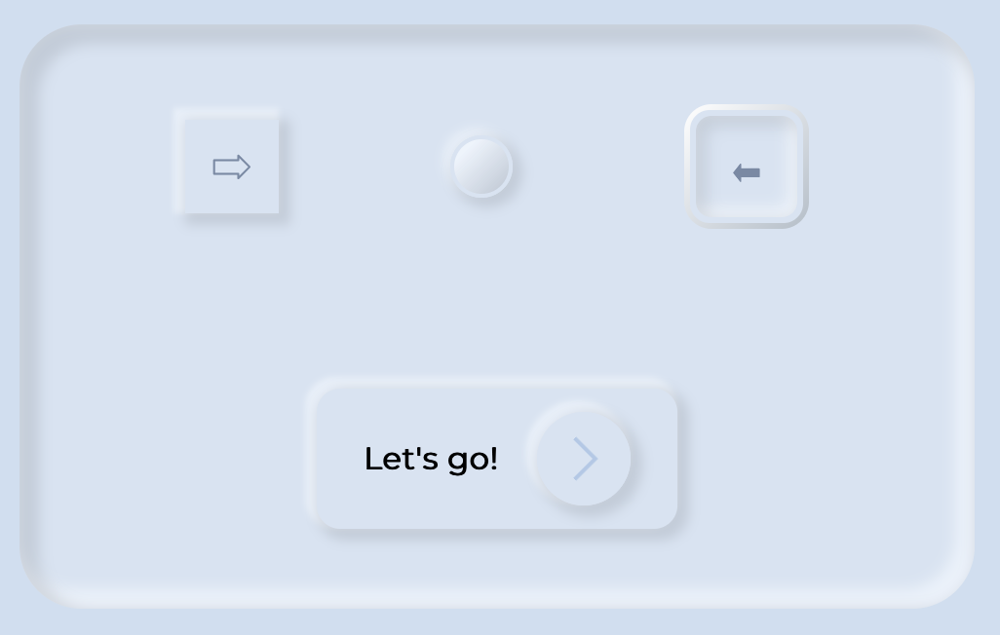

# Learning Neumorphism

Read: https://uxdesign.cc/neumorphism-in-user-interfaces-b47cef3bf3a6?gi=cae659cffc7f

See a [@CAWeissen](https://codepen.io/CAWeissen)'s demo: https://codepen.io/CAWeissen/pen/dyPWqLE : 



Simplified code:

```html
<div>Div</div>
<br/>
<button>Button</button>
```

```css
body {
    background: hsl(215, 50%, 88);
    padding: 10%;
}

div,
button {
    background: hsl(215, 50%, 90);
    border: 3px solid transparent;
    box-shadow:
        3px 3px 6px 3px rgba(0, 0, 0, 0.1),
        -3px -3px 3px 3px rgba(247, 251, 255, 0.5),
        3px 3px 8px 2px rgba(0, 0, 0, 0) inset,
        -3px -3px 7px 2px rgba(247, 251, 255, 0) inset;
    border: none;
    border-radius: 5px;
    padding: 5px;
}
```
